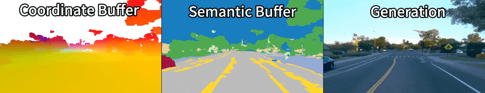
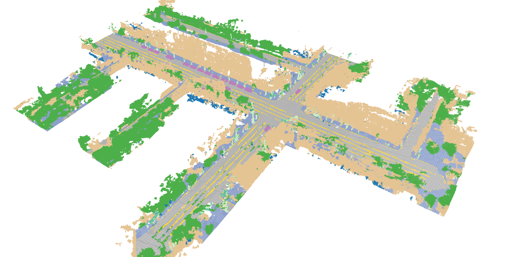

# InfiniCube

[](https://arxiv.org/abs/2412.03934)
[](https://research.nvidia.com/labs/toronto-ai/infinicube/)

<div align="center">

</div>

## Outline

Detailed documentation is organized by topic:

- **[Environment Setup](README/env.md)** - Setting up conda and Waymo environments
- **[Data Processing](README/dpip install -U "huggingface_hub"ata_process.md)** - Converting Waymo Open Dataset to webdataset format
- **[Training](README/training.md)** - Training models 
- **[Inference](README/inference.md)** - Running inference on trained models
- **[Visualization](README/visualize.md)** - Interactive visualization tools for data and results


## 🚀 Quick Start

This quick start guide demonstrates how to infer InfiniCube pipeline with trajectory mode.

### Prerequisites

1. **Environment Setup**: Follow [Environment Setup](README/env.md) to install dependencies
2. **Checkpoints**: [Download](https://huggingface.co/yifanlu/InfiniCube-checkpoints) or train the required model checkpoints:
   - `checkpoints/voxel_diffusion.ckpt` - Voxel diffusion model
   - `checkpoints/video_generation.safetensors` - Video generation model
   - `checkpoints/gsm_vs02_res512_view1_dual_branch_sky_mlp_modulator.ckpt` - Gaussian splatting model
   - `models/Wan-AI/Wan2.1-T2V-1.3B` - checkpoints required for wan 2.1 1.3B, please run `python infinicube/videogen/download_checkpoint.py` to download them.
3. **Input Data Sample**: [Download](https://huggingface.co/yifanlu/InfiniCube-data-sample) the data sample for inference, move the `data_sample/data` folder outside as `<InfiniCube-repo>/data`.

### Step 1: Voxel World Generation

Generate the voxel representation of the scene conditioned on map data:

```bash
python infinicube/inference/voxel_world_generation.py none \
    --mode trajectory \
    --use_ema --use_ddim --ddim_step 100 \
    --local_config infinicube/voxelgen/configs/diffusion_64x64x64_dense_vs02_map_cond.yaml \
    --local_checkpoint_path checkpoints/voxel_diffusion.ckpt \
    --clip 13679757109245957439_4167_170_4187_170 \
    --target_pose_num 8
```

**Output:** Voxel grids and visualization images are saved in `visualization/infinicube_inference/voxel_world_generation/trajectory/{clip}/`. To visualize the voxel grid, you can use the following command:
```bash
vis-grid -p visualization/infinicube_inference/voxel_world_generation/trajectory/13679757109245957439_4167_170_4187_170/7.pt
```


<div align="center">
<em>Generated voxel world</em>
</div>


### Step 2: Guidance Buffer Generation

Generate semantic buffer and coordinate buffer from the voxel world using original trajectory, and call video generation model to generate video. The buffer rendering is very speedy, however, the video generation's speed heavily relies on the video generation model implementation.

We reimplement video generation stage with Wan2.1 14B (text-to-video). It embeds guidance buffers to tokens and add to noisy tokens for conditoning. The default prompt is "The video is about a driving scene captured at daytime. The weather is clear." Since 14B model is large, it takes about 20 minutes to generate a 93 frame 480p video on a single A100 GPU (without considering model weight loading). We also provide a smaller one based on Wan2.1 1.3B (text-to-video), but it doesn't always follow conditions. 

We also trained a Wan2.1 14B (image-to-video) with guidance buffer conditon. Considering loading 2 14B model can be extremely slow, we only enabled text-to-video in our [inference API](infinicube/videogen/inference.py).

We provide training scripts of buffer conditioned Wan2.1 1.3B (t2v) and Wan2.1 14B (t2v, i2v)  in [diffsynth](https://github.com/yifanlu0227/DiffSynth-Studio-InfiniCube) with multinode training support.

```bash
python infinicube/inference/guidance_buffer_generation.py \
    --mode trajectory \
    --clip 13679757109245957439_4167_170_4187_170 \
    --extrap_voxel_root visualization/infinicube_inference/voxel_world_generation/trajectory \
    --make_dynamic --offset_unit frame --offset 1 --video_prompt "The video is capture by a camera mounted on a vehicle. The video is about a driving scene captured at daytime. The weather is clear."
```

**Output:** Guidance buffers and generated video are saved in `visualization/infinicube_inference/guidance_buffer_generation/trajectory_pose_sample_1frame/{clip}/`

<div align="center">


<em>guidance buffer and generated video</em>
</div>

### Step 3: Scene Gaussian Generation

Generate the final 3D Gaussian representation with static background and dynamic objects:

```bash
python infinicube/inference/scene_gaussian_generation.py none \
    --data_folder visualization/infinicube_inference/guidance_buffer_generation/trajectory_pose_sample_1frame/13679757109245957439_4167_170_4187_170 \
    --local_config infinicube/voxelgen/configs/gsm_vs02_res512_view1_dual_branch_sky_mlp_modulator.yaml \
    --local_checkpoint_path checkpoints/gsm_vs02_res512_view1_dual_branch_sky_mlp_modulator.ckpt
```

**Output:**
View the generated scene with viser:

```bash
python infinicube/visualize/visualize_dynamic_gaussians.py -p visualization/infinicube_inference/gaussian_scene_generation/trajectory_pose_sample_1frame/13679757109245957439_4167_170_4187_170
```


<div align="center">


<em>Generated dynamic scene</em>
</div>

The trajectory mode reuse the original trajectory in the dataset to generate the voxel world and guidance buffers. We also support **block mode**, which generate map-level voxel world and support interactive GUI to design the trajectory. For more details on **block mode** and inference options, see the [Inference Guide](README/inference.md). 
<div align="center">


<em>Voxel World Generated in Block Mode</em>
</div>

For more visualization tools and options, see the [Visualization Guide](README/visualize.md).


---

## 📁 Project Structure

```
InfiniCube-release/
├── infinicube/
│   ├── data_process/          # Data conversion and processing scripts
│   ├── inference/             # Inference scripts for all models
│   ├── visualize/             # Interactive visualization tools
│   ├── voxelgen/              # Core models and training code
│   │   ├── configs/           # Configuration files for all models
│   │   ├── models/            # VAE, diffusion, and GSM model implementations
│   │   └── data/              # Dataset loaders
│   ├── videogen/              # Video generation inference api
│   └── utils/                 # Utility functions
├── checkpoints/               # Model checkpoints
├── slurm/                     # SLURM job submission scripts
├── README/                    # Detailed documentation
│   ├── env.md                 # Environment setup
│   ├── data_process.md        # Data processing guide
│   ├── training.md            # Training guide
│   ├── inference.md           # Inference guide
│   └── visualize.md           # Visualization tools
└── README.md                  # This file
```

---

## 🛠️ Training Your Own Models

We provide the scripts for VAE, Voxel Diffusion, and GSM training. 

If you are interested in buffer conditioned video generation, we provide an implementation based on Wan2.1 1.3B (text-to-video) with [DiffSynth](https://github.com/yifanlu0227/DiffSynth-Studio-InfiniCube). 

For detailed training instructions, see the [Training Guide](README/training.md).

---

## 🔗 Related Works

- [XCube: Large-Scale 3D Generative Modeling using Sparse Voxel Hierarchies](https://research.nvidia.com/labs/toronto-ai/xcube/).
- [SCube: Instant Large-Scale Scene Reconstruction using VoxSplats](https://research.nvidia.com/labs/toronto-ai/scube/).
- [Cosmos-Drive-Dreams:Scalable Synthetic Driving Data Generation with World Foundation Models](https://research.nvidia.com/labs/toronto-ai/cosmos_drive_dreams/)

---


## 🎓 Citation

If you use InfiniCube in your research, please cite our paper:

```bibtex
@inproceedings{lu2025infinicube,
  title={Infinicube: Unbounded and controllable dynamic 3d driving scene generation with world-guided video models},
  author={Lu, Yifan and Ren, Xuanchi and Yang, Jiawei and Shen, Tianchang and Wu, Zhangjie and Gao, Jun and Wang, Yue and Chen, Siheng and Chen, Mike and Fidler, Sanja and others},
  booktitle={Proceedings of the IEEE/CVF International Conference on Computer Vision},
  pages={27272--27283},
  year={2025}
}
```

---

## 📧 Contact

For questions and issues, please open an issue on the GitHub repository or contact the code owner.


## 📜 License
This project will download and install additional third-party models and softwares. Note that these models or softwares are not distributed by NVIDIA. Review the license terms of these models and projects before use. This source code is released under the Apache 2 License. The pre-trained weights are provided for research and educational purposes only, users must strictly adhere to the [Waymo Open Dataset Terms of Service](https://waymo.com/open/terms/). Any commercial use of these weights is strictly prohibited.