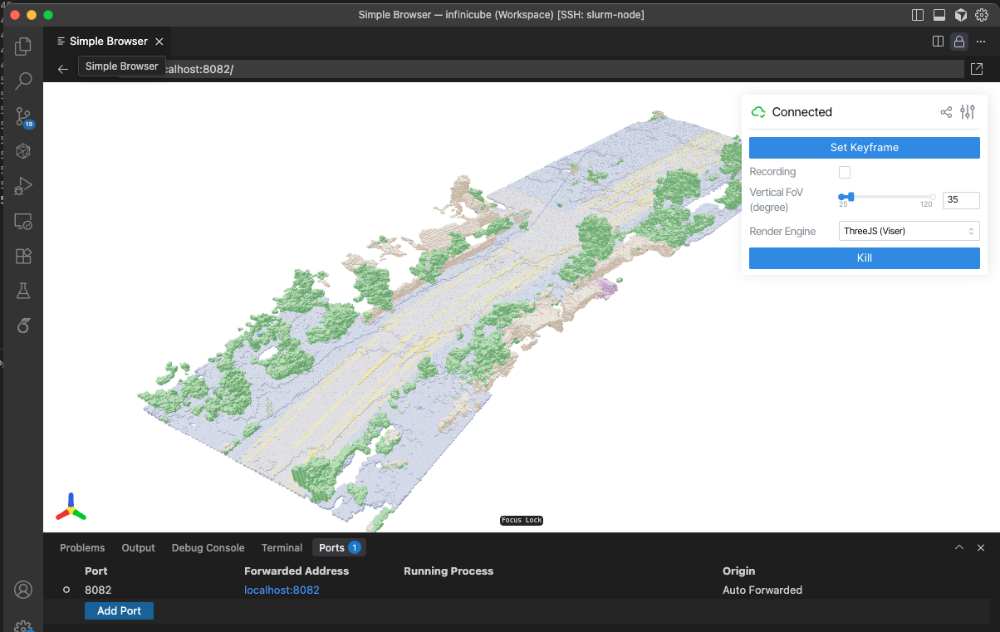
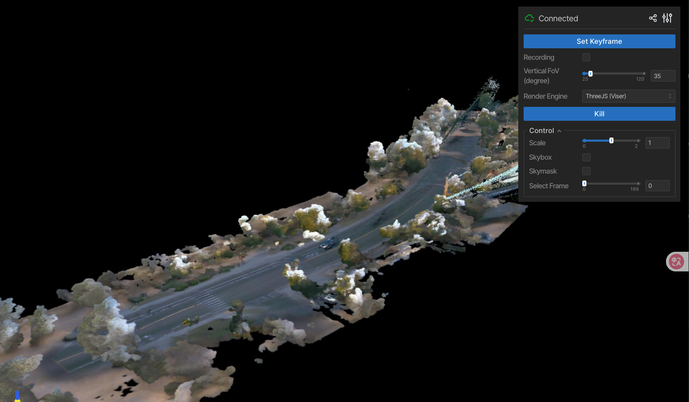

# Visualization Guide

InfiniCube provides several visualization tools for inspecting data and results at different stages of the pipeline. All visualization tools use [Viser](https://github.com/nerfstudio-project/viser) for interactive 3D rendering in the browser.

## Overview

The visualization tools are organized by purpose:

1. **Ground Truth Data Visualization** - Inspect webdataset data (point clouds, bounding boxes)
2. **Grid Data Visualization** - Visualize single voxel grids (VAE outputs, diffusion outputs, voxel world generation)
3. **Grid Data Comparison** - Compare multiple voxel grids side-by-side (predictions vs ground truth)
4. **Dynamic Gaussian Scene Visualization** - Visualize final 3D Gaussian scenes with animations

---

## 1. Ground Truth Data Visualization

**Script:** `infinicube/visualize/webdataset_data.py`

**Purpose:** Visualize ground truth point clouds and bounding boxes from processed webdataset data. This is useful for verifying data processing and understanding the dataset structure.

### Usage

```bash
# Visualize point cloud only
python infinicube/visualize/webdataset_data.py \
    --root data/ \
    --clip_id 10107710434105775874_760_000_780_000

# Visualize point cloud with bounding boxes
python infinicube/visualize/webdataset_data.py \
    --root data/ \
    --clip_id 10107710434105775874_760_000_780_000 \
    --vis_bbox
```

### Arguments

- `--root, -r`: Root path to the Waymo webdataset (default: `data/`)
- `--clip_id, -c`: Clip ID to visualize (e.g. `10107710434105775874_760_000_780_000`)
- `--vis_bbox, -b`: Flag to visualize bounding boxes (both static and dynamic)

### Features

- **Point Cloud Rendering**: Visualizes voxelized point clouds with semantic colors
- **Bounding Box Overlay**: 
  - Static objects in green
  - Dynamic objects in red
- **Interactive Navigation**: Use mouse to rotate, pan, and zoom in the browser

### Output

- Opens a Viser server (typically at `http://localhost:8080`)
- Navigate in your browser to interact with the 3D scene

### Notes

- Point clouds are loaded from `pc_voxelsize_01/{clip_id}.tar`
- Bounding boxes are loaded from `static_object_info/{clip_id}.tar` and `dynamic_object_info/{clip_id}.tar`
- Colors represent semantic classes using the Waymo Open Dataset color palette
- The coordinate system is the first frame's point cloud coordinate

---

## 2. Grid Data Visualization

**Script:** `infinicube/visualize/visualize_grid.py`

**Purpose:** Visualize single voxel grid files (.pt format) from VAE outputs, diffusion outputs, or voxel world generation results. This is useful for quick inspection of individual voxel grids without needing ground truth comparisons.


*Example of voxel grid visualization with semantic colors*

### Usage

#### Visualize as Mesh (default)

```bash
# Visualize VAE output
python infinicube/visualize/visualize_grid.py \
    -p visualization/voxel_vae/vae_64x64x64_height_down2_vs02_dense_residual/test_starting_at_50/0.pt

# Visualize diffusion output
python infinicube/visualize/visualize_grid.py \
    -p visualization/voxel_generation_single_chunk/diffusion_64x64x64_dense_vs02_map_cond/test_starting_at_50/0.pt

# Visualize voxel world generation result
python infinicube/visualize/visualize_grid.py \
    -p visualization/infinicube_inference/voxel_world_generation/trajectory/17407069523496279950_4354_900_4374_900/0.pt
```

#### Visualize as Point Cloud

```bash
# For large grids, use point cloud mode for better performance
python infinicube/visualize/visualize_grid.py \
    -p visualization/voxel_world_generation/trajectory/CLIP_NAME/11.pt \
    --render_type pc
```

### Arguments

- `--path, -p`: Path to the `.pt` file containing FVDB grid (required)
- `--port, -o`: Port number for Viser server (default: 8080)
- `--render_type, -t`: Rendering mode (default: `mesh`)
  - `mesh`: Render as solid voxel meshes (more accurate, recommended for small to medium scenes)
  - `pc`: Render as point clouds (faster, recommended for large scenes)
- `--palette, -pal`: Color palette for semantic visualization (default: `waymo_blue_sky`)
  - `waymo_blue_sky`: Waymo palette with blue sky
  - `waymo`: Standard Waymo palette
  - `deepmap_hierarchical`: DeepMap hierarchical colors
  - `deepmap_merged`: DeepMap merged colors

### File Format

The script expects `.pt` files containing:
- `points`: FVDB GridBatch
- `semantics`: Semantic labels (torch.Tensor)

These files are typically generated by:
- VAE inference: `infinicube/inference/voxel_vae.py`
- Diffusion inference: `infinicube/inference/voxel_generation_single_chunk.py`
- Voxel world generation: `infinicube/inference/voxel_world_generation.py`

---

## 3. Grid Data Comparison

**Script:** `infinicube/visualize/visualize_grid_compare.py`

**Purpose:** Visualize and compare voxel grids from VAE evaluation and diffusion model evaluation, which generate prediction and GT voxel pairs.

### Usage

#### Basic Comparison (GT vs Prediction)

```bash
# Compare ground truth with a single prediction in one folder.
python infinicube/visualize/visualize_grid_compare.py \
    -p visualization/voxel_generation_single_chunk/diffusion_64x64x64_dense_vs02_map_cond/test_starting_at_50
```

#### Multiple Predictions Comparison

```bash
# Compare ground truth with multiple grids side-by-side, make sure the first folder contains ground truth grid.
python infinicube/visualize/visualize_grid_compare.py \
    -p visualization/voxel_generation_single_chunk/diffusion_64x64x64_dense_vs02_map_cond/test_starting_at_50 \
    -p visualization/voxel_generation_single_chunk/diffusion_64x64x64_dense_vs02_map_cond/test_starting_at_50_map_grid
```


### Arguments

- `--paths, -p`: Directories containing `.pt` files (can specify multiple times for comparison)
- `--port, -o`: Port number for Viser server (default: 8080)
- `--type, -t`: Visualization type:
  - `voxel`: Render as voxel meshes (default)
  - `pc`: Render as point clouds (faster, better for high-resolution grids)
- `--size, -s`: Point size for point cloud visualization (default: 0.05)

### File Structure

The script expects files in the following format:
- Ground truth: `{batch_idx}_gt.pt` in the first path
- Predictions: `{batch_idx}.pt` in each path

Each `.pt` file should contain:
- `points`: FVDB GridBatch
- `semantics`: Semantic labels (torch.Tensor)

### Features

- **Side-by-Side Comparison**: Visualizes GT on the left, predictions on the right
- **Automatic Spacing**: Predictions are automatically spaced along the Y-axis for easy comparison
- **Semantic Colors**: Uses Cityscapes color palette for semantic visualization
- **Interactive Navigation**: Navigate through multiple samples using the GUI "Kill" button
- **Optional Rendering**: Saves rendered images to `visualization/grid_compare/{batch_idx}.png`


### Notes

- The first path must contain ground truth files (`*_gt.pt`)
- All paths should have the same number of samples
- Voxel mode is recommended for small to medium scenes (< 256³)
- Point cloud mode is better for large scenes or high-resolution grids (≥ 1024³)
- The script automatically centers the voxels for better visualization

---

## 4. Dynamic Gaussian Scene Visualization

**Script:** `infinicube/visualize/visualize_dynamic_gaussians.py`

**Purpose:** Visualize the final 3D Gaussian scene with animated dynamic objects for the final output of InfiniCube.


*Example of interactive dynamic Gaussian scene visualization with animated objects*

### Usage

```bash
python infinicube/visualize/visualize_dynamic_gaussians.py \
    -p visualization/infinicube_inference/gaussian_scene_generation/trajectory_pose_sample_1frame/13679757109245957439_4167_170_4187_170/
```

### Arguments

- `--scene_folder, -p`: Path to the Gaussian scene folder (required)
- `--switch_time`: Time interval to switch between timesteps (default: 0.25 seconds)

### Files in the scene folder

The scene folder should contain:
- `decoded_gs_static.pkl`: Static background Gaussians (required)
- `decoded_gs_object.pkl`: Dynamic object Gaussians 
- `dynamic_object_info.tar`: Dynamic object transformations per frame 
- Skybox information embedded in `decoded_gs_static.pkl` 


